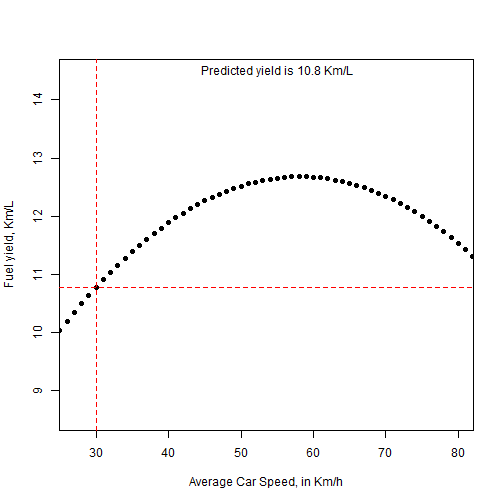

## Summary

1. This Shiny App is a visualization of a fuel consumption prediction model.
2. My FIAT Punto can be fueled with either Gasoline or Ethanol. Over 3 years I built a model to understand what is the fuel yield (in Km/L) as a function of the fuel blend. How (and where) car is driven, represented by average speed, is also taken into consideration.
3. The prediction model can be visualized by tweaking the controls of the provided app (as seen in image below).


---

## How it works (1/3)

Data is recorded as follows:


```r
puntoData <- read.csv('PuntoData.csv', sep=";")
head(puntoData)
```

```
##   Avg_Speed Pct_Ethanol Avg_Speed_sq Pct_Ethanol.Avg_Speed Yield_km_Liter
## 1        28       0.008          784                 0.224         11.143
## 2        52       0.002         2704                 0.104         14.275
## 3        41       0.001         1681                 0.041         13.521
## 4        29       0.000          841                 0.000         11.909
## 5        29       0.761          841                22.069         10.354
## 6        54       0.834         2916                45.036         10.826
```

---

## How it works (2/3)

A linear model is used to build the prediction model from the dataset.

```r
model <- lm(Yield_km_Liter ~ Avg_Speed + Pct_Ethanol + 
            Avg_Speed_sq + Pct_Ethanol.Avg_Speed, data=puntoData)
coef <- as.vector(model$coefficients)
yield <- function(a,p){
  y <- coef[1]+coef[2]*a+coef[3]*p+coef[4]*a*a+coef[5]*p*a
  return(y)
}
```

A plot will render and both variables can be changed by Shiny controls to allow the interaction. The predicted fuel Yield, in Km/L, is seen in the chart.
In next slide's example, Avg. Speed is set at 30 km/h and Pct. Ethanol in the blend is set at 50%.


```r
a <- 30
p <- 0.5
```

---

```r
plot(yield(1:max(puntoData[1]),p), pch = 20, cex = 1.4, xlim=c(27,80), ylim=c(min(yield(25:82,1)),
     max(yield(25:82,0))), xlab = "Average Car Speed, in Km/h", ylab = "Fuel yield, Km/L")
     abline(h=yield(a,p), lty=2, col="red"); abline(v = a, lty=2, col="red"); text(x=55, y=14.5,
     paste("Predicted yield is", round(yield(a, p),1), "Km/L"))
```

 


